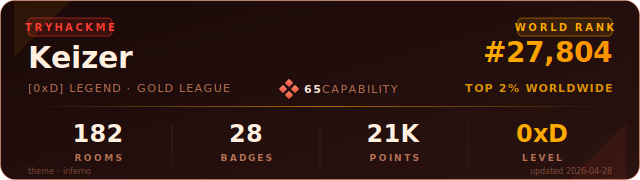
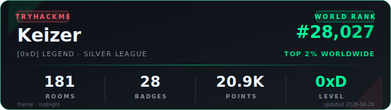
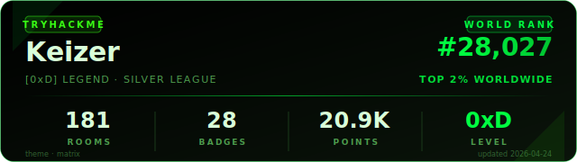
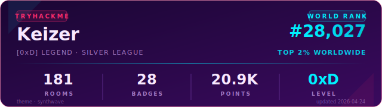
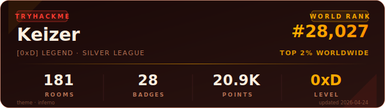
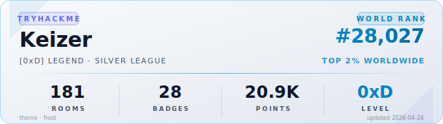

# TryHackMe Badge

<p align="center">
  <a href="https://github.com/KeizerSec/Tryhackme-Badge/releases/latest"></a>
  <a href="https://github.com/KeizerSec/Tryhackme-Badge/actions/workflows/ci.yml"></a>
  <a href="LICENSE"></a>
  <a href="https://github.com/KeizerSec/Tryhackme-Badge/stargazers"></a>
</p>

A GitHub Action that generates a beautiful, self-updating SVG badge with your live TryHackMe stats — rank, rooms, badges, level, league — straight from the official public profile API.

<p align="center">
  
</p>

> Spiritual successor to the now-archived [`p4p1/tryhackme-badge-workflow`](https://github.com/p4p1/tryhackme-badge-workflow). Pure SVG. No Puppeteer. No Chrome on your runner. No HTML scraping.

---

## Features

- **Live data** — pulls from the official `tryhackme.com/api/v2/public-profile` endpoint, no auth required
- **5 themes** — `midnight`, `matrix`, `synthwave`, `inferno`, `frost` (see gallery below)
- **Rotating themes** — defaults to `rotate`: deterministic per UTC day, so visitors see the same theme worldwide on a given day, but it changes overnight
- **Pure SVG** — no external fonts, no remote images, renders instantly through GitHub's image proxy
- **Customizable** — override the accent color, lock to one theme, change the output path, disable auto-commit
- **Lightweight** — composite action, zero npm dependencies, runs in under 15 seconds on a stock runner

---

## Quick start

### TL;DR — minimal install

Add this to `.github/workflows/thm-badge.yml` in your **profile repository** (the one named like your username):

```yaml
on: { schedule: [{ cron: '17 5 * * *' }], workflow_dispatch: }
permissions: { contents: write }
jobs:
  update:
    runs-on: ubuntu-latest
    steps:
      - uses: actions/checkout@v6
      - uses: KeizerSec/Tryhackme-Badge@v1
        with: { username: YourThmUsername }
```

Then add this to your `README.md`:

```markdown

```

Go to **Actions → Update TryHackMe Badge → Run workflow** to trigger it once. After that, it refreshes daily.

> **Make sure** your workflow has `permissions: contents: write` — without it, the action cannot commit the refreshed SVG and the daily run will fail with a 403.

### Recommended — the readable version

```yaml
name: Update TryHackMe Badge

on:
  schedule:
    - cron: '17 5 * * *'
  workflow_dispatch:

permissions:
  contents: write

jobs:
  update:
    runs-on: ubuntu-latest
    steps:
      - uses: actions/checkout@v6
      - uses: KeizerSec/Tryhackme-Badge@v1
        with:
          username: YourThmUsername
```

---

## Theme gallery

The default `theme: rotate` cycles through these five themes, advancing by one every UTC day:

**`midnight`** — balanced SOC analyst look, dark GitHub background, chartreuse accent



**`matrix`** — pure black background, phosphor green, terminal-vintage



**`synthwave`** — deep purple background, magenta and cyan accents, 80s retrowave



**`inferno`** — charcoal background, ember orange and amber, red-team energy



**`frost`** — light background with ice blue accents, for light-mode READMEs



To **lock** the badge to a single theme:

```yaml
- uses: KeizerSec/Tryhackme-Badge@v1
  with:
    username: YourThmUsername
    theme: matrix
```

To **customize** the accent color while keeping a theme:

```yaml
- uses: KeizerSec/Tryhackme-Badge@v1
  with:
    username: YourThmUsername
    theme: midnight
    accent_color: "#FF6B35"
```

---

## Inputs

| Name | Required | Default | Description |
|---|:---:|---|---|
| `username` | yes | — | Your TryHackMe username. |
| `output_path` | no | `assets/thm_badge.svg` | Where the SVG is written, relative to **your** repo's root. |
| `theme` | no | `rotate` | `rotate` (deterministic per UTC day), `random` (per-run), or one of: `midnight`, `matrix`, `synthwave`, `inferno`, `frost`. |
| `accent_color` | no | — | Hex color (e.g. `#00FF9D`) that overrides the theme accent and border. |
| `auto_commit` | no | `true` | Whether to commit and push the updated badge. Set to `false` to write the file only (useful for PR-based workflows). |
| `commit_message` | no | `chore: refresh TryHackMe badge` | Commit message used when `auto_commit` is true. |
| `committer_name` | no | `github-actions[bot]` | Git committer name. |
| `committer_email` | no | `41898282+github-actions[bot]@users.noreply.github.com` | Git committer email (this is GitHub's canonical bot email). |

## Outputs

| Name | Description |
|---|---|
| `theme_used` | Name of the theme that was actually rendered. |
| `rank` | Current world rank value reported by the API. |

---

## Troubleshooting

**`Permission to <you>/<you>.git denied to github-actions[bot]` (HTTP 403)**
Your workflow is missing `permissions: contents: write`. Add it at the workflow level (top of the YAML) or at the job level. See the Quick start above.

**The badge doesn't appear in my README even after the workflow ran successfully**
GitHub serves images through a cache (Camo). Force-refresh the README page (Cmd+Shift+R / Ctrl+F5). If you just ran the workflow for the first time, also wait ~30 seconds for the commit to propagate to `raw.githubusercontent.com`.

**The badge updated, but I don't see the new stats in my README**
Same Camo cache. The image URL on `raw.githubusercontent.com` is fresh, but GitHub's proxy caches it. Either force-refresh, or append a cache-buster like `?v=2` to the image URL in your README.

**The action says my username is invalid / API returns 404**
The `username` input is **case-sensitive** and must match exactly what appears in your TryHackMe profile URL (the part after `tryhackme.com/p/`). Common mistake: passing the email or the display name instead of the URL slug.

**The daily cron doesn't seem to be running**
GitHub disables scheduled workflows on repos that have had no activity for 60 days. Push any commit to wake it back up. Also keep in mind cron times are UTC.

**Nothing shows up in `Used by` for my action**
For the action's *own* dependents graph: GitHub indexing takes 24-48h after the first dependent is added.

---

## How it works

The action calls the TryHackMe public profile API:

```
GET https://tryhackme.com/api/v2/public-profile?username=<you>
```

It returns clean JSON with rank, rooms, badges, points, level, and league tier. The action renders a self-contained SVG using inline gradients and SVG primitives only — no `@font-face`, no remote images, no JavaScript inside the SVG — so GitHub's image proxy serves it without sandboxing issues.

The output SVG is written into **your** repository (at `output_path`) and committed by the bot. Your README references it via `raw.githubusercontent.com`, so each visitor sees the latest committed version.

## Why not p4p1's action?

The original [`p4p1/tryhackme-badge-workflow`](https://github.com/p4p1/tryhackme-badge-workflow) was archived on 2026-04-19. Its dynamic mode relies on `tryhackme.com/api/v2/badges/public-profile?userPublicId=...`, which currently returns *"There was an error while generating your badge"* for any input from outside TryHackMe's own infrastructure. Its static mode pulled from `tryhackme-badges.s3.amazonaws.com`, a bucket that has been frozen since 2024.

This action uses a different, working endpoint and renders the SVG itself, so it is independent of TryHackMe's own badge rendering pipeline.

---

## Local preview

You can render any theme locally without setting up a workflow:

```bash
git clone https://github.com/KeizerSec/Tryhackme-Badge.git
cd Tryhackme-Badge
THM_USERNAME=YourThmUsername THEME=synthwave OUTPUT_PATH=/tmp/badge.svg node src/generate.js
open /tmp/badge.svg
```

Set `THEME` to any of the five names, or to `rotate` / `random`. Requires Node.js 20+.

## Compatibility

- Runs on `ubuntu-latest`, `macos-latest`, and `windows-latest` GitHub-hosted runners
- Node.js 22 (set automatically by the action via `actions/setup-node@v6`)
- Zero npm dependencies — no `npm install` step needed

## License

MIT — see [LICENSE](LICENSE).
