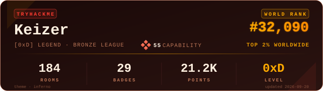
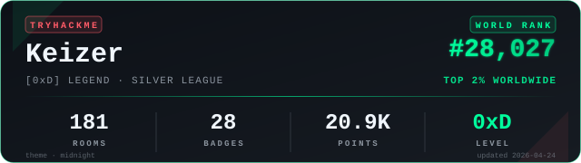
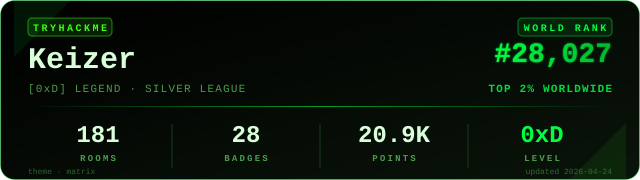
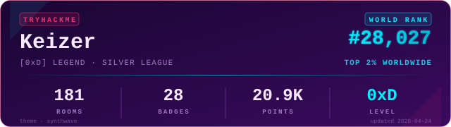
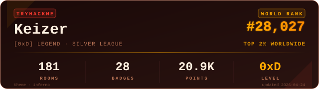
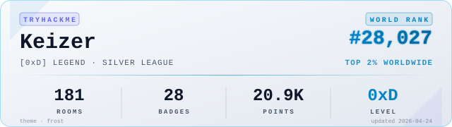

# TryHackMe Badge

<p align="center">
  <a href="https://github.com/KeizerSec/Tryhackme-Badge/releases/latest"></a>
  <a href="https://github.com/KeizerSec/Tryhackme-Badge/actions/workflows/ci.yml"></a>
  <a href="LICENSE"></a>
  <a href="https://github.com/KeizerSec/Tryhackme-Badge/stargazers"></a>
</p>

A GitHub Action that generates a beautiful, self-updating SVG badge with your live TryHackMe stats — rank, rooms, badges, level, league — straight from the official public profile API.

<p align="center">
  
</p>

> Spiritual successor to the now-archived [`p4p1/tryhackme-badge-workflow`](https://github.com/p4p1/tryhackme-badge-workflow). Pure SVG. No Puppeteer. No Chrome. No HTML scraping.

> **⚠️ Heads-up (June 2026).** TryHackMe moved its API behind Vercel's anti-bot challenge, which blocks every datacenter IP — so **GitHub-hosted runners can no longer fetch your stats**. The badge now refreshes from **any machine on a home/residential connection** via a small daily cron (see [Quick start](#quick-start)). Same badge, same themes — only *where it runs* changed.

---

## Features

- **Live data** — pulls from the official `tryhackme.com/api/v2/public-profile` endpoint, no auth required
- **5 themes** — `midnight`, `matrix`, `synthwave`, `inferno`, `frost` (see gallery below)
- **Rotating themes** — defaults to `rotate`: deterministic per UTC day, so visitors see the same theme worldwide on a given day, but it changes overnight
- **Pure SVG** — no external fonts, no remote images, renders instantly through GitHub's image proxy
- **Customizable** — override the accent color, lock to one theme, change the output path, disable auto-commit
- **Lightweight** — pure-Node SVG renderer plus one small Python helper (`curl_cffi`) for the fetch; no Chromium, no npm dependencies

---

## Quick start

Run it from any machine on a **residential connection** (your laptop, a home server, a Raspberry Pi…). Three steps.

### 1 — Install once

```bash
# Node.js 20+, Git and Python 3 must already be installed.
pip install --user curl_cffi                                              # browser-grade fetch, gets past Vercel
git clone https://github.com/KeizerSec/Tryhackme-Badge.git ~/.thm-badge   # the renderer
```

### 2 — The refresh command

Run this **inside your profile repository** (the one named like your username):

```bash
THM_USERNAME=YourThmUsername THEME=rotate OUTPUT_PATH=assets/thm_badge.svg \
  node ~/.thm-badge/src/generate.js \
  && git add assets/thm_badge.svg \
  && git commit -m "chore: refresh TryHackMe badge" \
  && git push
```

Then reference the image in your `README.md`:

```markdown

```

### 3 — Automate it daily

**Linux** — `crontab -e`, then add (13:00 every day):

```cron
0 13 * * * cd ~/your-profile-repo && THM_USERNAME=YourThmUsername THEME=rotate OUTPUT_PATH=assets/thm_badge.svg node ~/.thm-badge/src/generate.js && git add -A && git commit -m "chore: refresh TryHackMe badge" && git push
```

**macOS** — use a launchd agent instead of cron (cron can't read `~/Documents`). Put the refresh command in a small script **outside** `~/Documents` (e.g. `~/.thm-badge/refresh.sh`), then schedule it: a ready-to-edit plist template ships in [`scripts/com.keizersec.thm-badge.plist`](scripts/com.keizersec.thm-badge.plist) — point its `ProgramArguments` at your script, drop it in `~/Library/LaunchAgents/`, and `launchctl load -w` it.

**Windows** — save a `refresh-badge.cmd` in your profile repo:

```bat
@echo off
cd /d C:\path\to\your-profile-repo
set THM_USERNAME=YourThmUsername
set THEME=rotate
set OUTPUT_PATH=assets/thm_badge.svg
node "%USERPROFILE%\.thm-badge\src\generate.js" && git add -A && git commit -m "chore: refresh TryHackMe badge" && git push
```

then register it as a daily task (Task Scheduler), e.g. at 13:00:

```powershell
schtasks /create /tn "TryHackMe Badge" /tr "C:\path\to\refresh-badge.cmd" /sc daily /st 13:00
```

> The badge only updates when your machine is on. If it's asleep at the scheduled time, launchd (macOS) runs the job at the next wake; cron (Linux) and Task Scheduler (Windows, with *"Run task as soon as possible after a missed start"* enabled) run it the next time the machine is up.

---

## Theme gallery

The default `theme: rotate` cycles through these five themes, advancing by one every UTC day:

**`midnight`** — balanced SOC analyst look, dark GitHub background, chartreuse accent



**`matrix`** — pure black background, phosphor green, terminal-vintage



**`synthwave`** — deep purple background, magenta and cyan accents, 80s retrowave



**`inferno`** — charcoal background, ember orange and amber, red-team energy



**`frost`** — light background with ice blue accents, for light-mode READMEs



To **lock** the badge to a single theme, set `THEME`:

```bash
THM_USERNAME=YourThmUsername THEME=matrix OUTPUT_PATH=assets/thm_badge.svg node ~/.thm-badge/src/generate.js
```

To **customize** the accent color while keeping a theme, add `ACCENT_COLOR`:

```bash
THM_USERNAME=YourThmUsername THEME=midnight ACCENT_COLOR="#FF6B35" OUTPUT_PATH=assets/thm_badge.svg node ~/.thm-badge/src/generate.js
```

---

## Inputs

When running directly (`node src/generate.js`), pass these as environment variables in UPPERCASE — `THM_USERNAME`, `OUTPUT_PATH`, `THEME`, `ACCENT_COLOR`. The `auto_commit` / `committer_*` / `commit_message` inputs apply only to the composite action (`uses: KeizerSec/Tryhackme-Badge@v1`) on a self-hosted residential runner.

| Name | Required | Default | Description |
|---|:---:|---|---|
| `username` | yes | — | Your TryHackMe username. |
| `output_path` | no | `assets/thm_badge.svg` | Where the SVG is written, relative to **your** repo's root. |
| `theme` | no | `rotate` | `rotate` (deterministic per UTC day), `random` (per-run), or one of: `midnight`, `matrix`, `synthwave`, `inferno`, `frost`. |
| `accent_color` | no | — | Hex color (e.g. `#00FF9D`) that overrides the theme accent and border. |
| `auto_commit` | no | `true` | Whether to commit and push the updated badge. Set to `false` to write the file only (useful for PR-based workflows). |
| `commit_message` | no | `chore: refresh TryHackMe badge` | Commit message used when `auto_commit` is true. |
| `committer_name` | no | `github-actions[bot]` | Git committer name. |
| `committer_email` | no | `41898282+github-actions[bot]@users.noreply.github.com` | Git committer email (this is GitHub's canonical bot email). |

## Outputs

| Name | Description |
|---|---|
| `theme_used` | Name of the theme that was actually rendered. |
| `rank` | Current world rank value reported by the API. |

---

## Troubleshooting

**`Permission to <you>/<you>.git denied to github-actions[bot]` (HTTP 403)**
Only relevant if you run the composite action on a self-hosted runner: the workflow is missing `permissions: contents: write`. Add it at the workflow or job level. (The local `node src/generate.js` flow pushes with your own Git credentials, so this doesn't apply.)

**The badge doesn't appear in my README even after the job ran successfully**
GitHub serves images through a cache (Camo). Force-refresh the README page (Cmd+Shift+R / Ctrl+F5). If you just ran it for the first time, also wait ~30 seconds for the commit to propagate to `raw.githubusercontent.com`.

**The badge updated, but I don't see the new stats in my README**
Same Camo cache. The image URL on `raw.githubusercontent.com` is fresh, but GitHub's proxy caches it. Either force-refresh, or append a cache-buster like `?v=2` to the image URL in your README.

**The action says my username is invalid / API returns 404**
The `username` input is **case-sensitive** and must match exactly what appears in your TryHackMe profile URL (the part after `tryhackme.com/p/`). Common mistake: passing the email or the display name instead of the URL slug.

**The daily cron doesn't seem to be running**
The job runs **on your own machine**, so it only fires while that machine is awake. Check it runs by hand first (`node ~/.thm-badge/src/generate.js …`), confirm the schedule is loaded (`crontab -l` on Linux, `launchctl list | grep thm-badge` on macOS, `schtasks /query /tn "TryHackMe Badge"` on Windows), and remember cron/launchd use **local** time.

**`could not fetch profile via browser-TLS … (mitigated=challenge)`**
You're running from a datacenter IP (a VPS, a CI runner, a VPN exit). Vercel challenges those regardless of TLS — run it from a residential connection.

**Nothing shows up in `Used by` for my action**
For the action's *own* dependents graph: GitHub indexing takes 24-48h after the first dependent is added.

---

## How it works

The action calls the TryHackMe public profile API:

```
GET https://tryhackme.com/api/v2/public-profile?username=<you>
```

The endpoint sits behind Vercel's anti-bot challenge, which serves a JS checkpoint to any non-browser TLS fingerprint. The fetch therefore goes through a tiny `curl_cffi` helper that reproduces a real Chrome handshake, so the API returns clean JSON with rank, rooms, badges, points, level, and league tier. The renderer then builds a self-contained SVG using inline gradients and SVG primitives only — no `@font-face`, no remote images, no JavaScript inside the SVG — so GitHub's image proxy serves it without sandboxing issues.

The output SVG is written into **your** repository (at `output_path`) and committed by your daily job. Your README references it via `raw.githubusercontent.com`, so each visitor sees the latest committed version.

## Why not p4p1's action?

The original [`p4p1/tryhackme-badge-workflow`](https://github.com/p4p1/tryhackme-badge-workflow) was archived on 2026-04-19. Its dynamic mode relies on `tryhackme.com/api/v2/badges/public-profile?userPublicId=...`, which currently returns *"There was an error while generating your badge"* for any input from outside TryHackMe's own infrastructure. Its static mode pulled from `tryhackme-badges.s3.amazonaws.com`, a bucket that has been frozen since 2024.

This action uses a different, working endpoint and renders the SVG itself, so it is independent of TryHackMe's own badge rendering pipeline.

---

## Local preview

You can render any theme locally without setting up a workflow:

```bash
git clone https://github.com/KeizerSec/Tryhackme-Badge.git
cd Tryhackme-Badge
THM_USERNAME=YourThmUsername THEME=synthwave OUTPUT_PATH=/tmp/badge.svg node src/generate.js
open /tmp/badge.svg
```

Set `THEME` to any of the five names, or to `rotate` / `random`. Requires Node.js 20+ and Python 3 with `curl_cffi` (`pip install --user curl_cffi`), and a residential connection.

## Compatibility

- Runs on **any machine with a residential IP** — laptop, home server, Raspberry Pi (Linux, macOS, Windows). **Not** on GitHub-hosted runners: Vercel's anti-bot challenge blocks their datacenter IPs.
- Node.js 20+ and Python 3 with `curl_cffi`
- Zero npm dependencies — no `npm install` step needed

## License

MIT — see [LICENSE](LICENSE).
